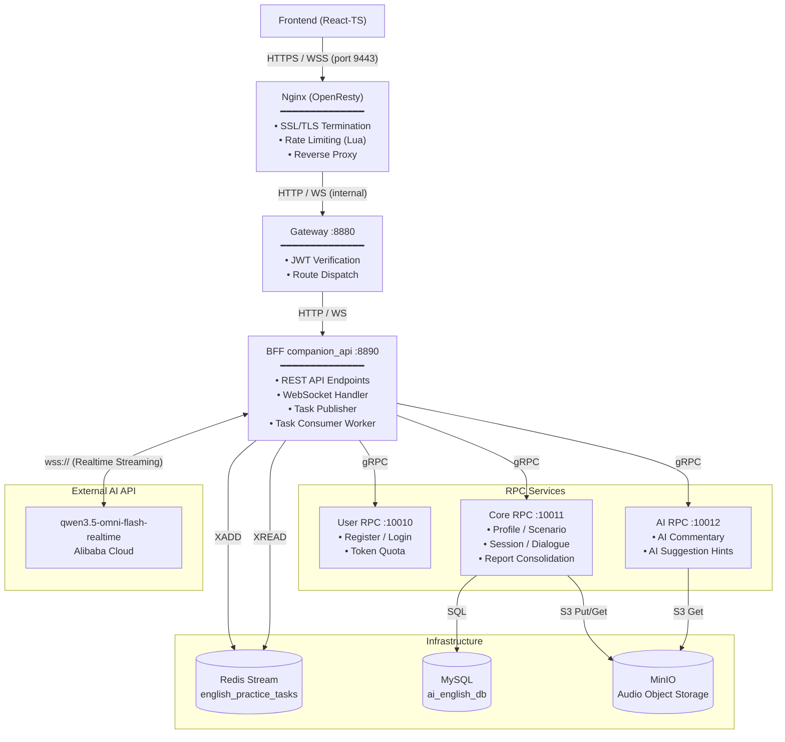

# AI English Speaking Companion (AI 英语口语陪练)

一款基于现代微服务架构与 Web Audio 实时通信技术的 AI 英语口语对讲练习与量化评测系统。系统支持多维练习场景选择（包括预设场景如外企面试、西餐点餐、雅思口语模拟、商务会议等，以及用户自定义场景）、高灵敏的实时语音对讲、智能提示和课后的语法/发音多维度分析成绩单。

---

## 📺 视频演示与设计讲解

🎬 **项目演示与视频汇报**：[点击观看 Bilibili 视频](https://www.bilibili.com/video/BV132Ex6kEAx/)

---

## 🏗️ 系统架构设计

系统由 **Frontend (React-TS)** 交互层、**Nginx (OpenResty)** 反向代理与 SSL 卸载层、**Gateway** JWT 鉴权与路由层、**BFF companion_api** REST/WebSocket 聚合层、**RPC 微服务** 领域层以及 **Redis Stream 异步任务队列** 组成。



---

## 🌟 核心功能特性

1. **个性化学习背景档案 (Step 1)**
   - 支持对用户当前的英语口语水平级别（初级 🌱、中级 🚀、高级 🏆）进行一键设定。
   - 允许用户定义详细的口语练习目标与练习侧重点。
2. **多场景智能切换练习 (Step 2)**
   - **外企求职面试 (Job Interview)**：模拟外企 HR 及技术面试官的专业英语提问。
   - **西餐点餐体验 (Ordering Food)**：练习日常用餐中的表达、菜品询问与结账会话。
   - **雅思口语模拟 (IELTS Speaking)**：覆盖雅思 Part 1-3 流程的模拟真题对答。
   - **商务会议沟通 (Business Meeting)**：练习职场讨论中的报告呈递、意见阐述与讨论。
   - **自定义练习场景**：用户可输入专有场景名称与 AI 引导 Prompts 进行专属互动。
3. **低延迟端到端语音对讲 (Step 3)**
   - 前端利用 Web Audio API 捕获 16kHz 的单声道 PCM 语音，通过双向 WebSocket 协议分片流式上传至后台 Gateway。
   - 后台自适应桥接多模态大语言模型（如 Gemini Live / Qwen-Omni 实时语音流），实现毫秒级语音回复。
4. **实时智能提示 (AI Hint)**
   - 大模型在完成发问后，后台根据上下文提示词系统在短时间内生成句式模版。
   - 前端以半透明毛玻璃提示卡片呈现，实时给出口语表达提示，解决口语对讲过程中的“卡壳”问题。
5. **多维能力量化报告 (Report Page)**
   - 对话结束后自动转录完整对话记录（AI Speaker 与您的对答）。
   - 从流利与连贯性（Fluency & Flow）、用词与表达（Vocabulary & Word）、语法与准确性（Grammar & Accuracy）、发音（Pronunciation）四个维度，以直观的彩色进度条形式展示百分制量化得分；并针对各项能力提供精细化的双语反馈与地道改写建议（Refined Rewrite），给出系统总体评估。

---

## 📂 项目目录结构

```text
ai_english_companion/
├── backend/                  # 后端 Go-zero 微服务
│   ├── gateway/              # 网关层，处理统一 JWT 鉴权与服务路由分发
│   ├── companion_api/        # BFF 服务，提供 REST API 和实时 WebSocket 接口
│   ├── common/               # 跨服务共用资源 (AI 提示词模版等)
│   ├── pkg/                  # 公用工具包 (鉴权、错误响应、存储适配器)
│   ├── rpc/                  # RPC 领域微服务层
│   │   ├── ai/               # AI 评测与锦囊 RPC 服务
│   │   ├── core/             # 核心业务 (用户档案/场景/会话) 数据库读写 RPC 服务
│   │   └── user/             # 用户管理及 Token 额度控制 RPC 服务
│   ├── init.sql              # MySQL 数据库初始化 SQL 脚本
│   └── go.mod                # Go 后端依赖配置
├── frontend/                 # 前端 React-TypeScript SPA
│   ├── public/               # 公用静态资源
│   ├── src/
│   │   ├── assets/           # 图片、图标等静态资源
│   │   ├── components/       # 成绩柱状图、毛玻璃卡片、音频波形图等通用组件
│   │   ├── hooks/            # 自定义 React Hooks (如麦克风权限管理)
│   │   ├── pages/            # 仪表盘配置页、对讲房间页、评估报告页
│   │   ├── services/         # 前端 API 请求与数据网桥服务
│   │   ├── store/            # 全局状态管理 (用户鉴权信息)
│   │   └── styles/           # 统一色调系统 (CSS Variables) 与全平台毛玻璃特效
│   └── package.json          # Node 依赖配置与 Vite 编译脚本
├── example_configs/          # 参考配置示例 (Nginx, Lua 限流脚本)
└── README.md                 # 项目说明文档
```

---

## 🚀 运行指南

### 技术栈

| 层级 | 技术 |
|------|------|
| 前端 | React 19 + TypeScript + Vite 6，Web Audio API，WebSocket |
| 后端 | Go 1.24，go-zero 微服务框架，gRPC (protobuf)，Redis Stream |
| 反向代理 | OpenResty (Nginx + LuaJIT)，Lua 限流脚本 |
| 数据存储 | MySQL 8.0，MinIO (latest)，Redis 7.2 |
| AI 接口 | Alibaba Cloud DashScope — `qwen3.5-omni-flash-realtime` 实时语音流 API |

### 基础设施依赖

运行本项目前，需确保以下服务已在您的环境中启动：

- **Redis 7.2** — 任务队列与限流计数存储
- **MySQL 8.0** — 业务数据持久化；导入 `backend/init.sql` 完成初始化
- **MinIO (latest)** — 音频对话文件对象存储
- **Nginx / OpenResty (openresty/1.29.2.4)** — SSL 卸载、Lua 限流与反向代理；参考配置见 `example_configs/nginx.conf` 与 `example_configs/limit.lua`

### 安装依赖

```bash
# 后端：在 backend/ 目录下拉取 Go 模块依赖
cd backend
go mod download

# 前端：在 frontend/ 目录下安装 Node 依赖
cd frontend
npm install
```

### 环境变量

复制并编辑 `backend/.env`。**注意：** 此文件仅用于存放需要保密的 API Key 以及 Token 签名密钥等敏感信息。数据库、Redis、MinIO 等连接与端口配置已统一写入各微服务的 YAML 配置文件中（如 `backend/etc/*.yaml`）。

```env
# 阿里云百炼 API Key 1
DASHSCOPE_API_KEY1=your_dashscope_api_key_1
# 阿里云百炼 API Key 2
DASHSCOPE_API_KEY2=your_dashscope_api_key_2
# 谷歌 Gemini API Key (非必须)
GEMINI_API_KEY=your_gemini_api_key
# JWT 鉴权签名密钥
JWT_SECRET=your_jwt_secret_key
```

**配置项说明：**
- **`DASHSCOPE_API_KEY1` 与 `DASHSCOPE_API_KEY2`**：两者填写的 API Key 内容可以完全相同。系统中特意区分两个 Key 变量，是为了在用户高频对话时，将“实时语音对讲”（BFF 流式转发）与“智能提示/评估报告生成”（AI-RPC 异步任务）分流到不同的 API Key，从而有效规避阿里云百炼平台针对单个账号在短时间内设定的并发与 QPS 限流限制。
- **`GEMINI_API_KEY`**：非必须。如果您计划使用谷歌的模型作为 AI 英语口语陪练者，需填入此 Key，并在 `backend/companion_api/etc/companion-api.yaml` 配置文件中将模型配置项切换为 Gemini 对应的模型。
- **`JWT_SECRET`**：系统的 JWT 鉴权签名密钥。Gateway 网关与 User RPC 服务将使用此密钥来签名并校验用户的访问 Token，用以确保 API 接口的安全性。

### 在 Linux（Ubuntu 22.04.5 LTS）上启动服务

**推荐方式：** 在本地进行交叉编译，将二进制产物与配置文件上传至服务器后一键启动。

#### 1. 本地交叉编译 (Windows / macOS)

在本地终端进入 `backend` 目录，编译为 Linux AMD64 二进制文件：

```bash
cd backend
GOOS=linux GOARCH=amd64 go build -ldflags="-s -w" -o build/gateway         gateway/main.go
GOOS=linux GOARCH=amd64 go build -ldflags="-s -w" -o build/companion_api   companion_api/companion.go
GOOS=linux GOARCH=amd64 go build -ldflags="-s -w" -o build/user-rpc        rpc/user/user.go
GOOS=linux GOARCH=amd64 go build -ldflags="-s -w" -o build/core-rpc        rpc/core/core.go
GOOS=linux GOARCH=amd64 go build -ldflags="-s -w" -o build/ai-rpc          rpc/ai/ai.go
```

#### 2. 部署目录结构设计

将本地生成的 `build/` 目录、`.env` 配置文件、`start_services.sh` 脚本以及各微服务的 `*.yaml` 配置文件上传至 Linux 服务器。

请确保服务器上的**部署目录结构**如下（`start_services.sh` 会在执行时根据此相对结构自动加载配置和二进制文件）：

```text
/path/to/ai_english_companion/
├── start_services.sh                  # 一键启动脚本，位于项目根目录
└── backend/
    ├── .env                           # 环境密钥配置文件
    ├── build/                         # 存放编译好的 Linux 二进制文件
    │   ├── gateway
    │   ├── companion_api
    │   ├── user-rpc
    │   ├── core-rpc
    │   └── ai-rpc
    └── etc/                           # 推荐将各微服务的 YAML 配置文件统一存放在此（或放置在各服务子目录的 etc/ 下）
        ├── gateway.yaml
        ├── companion-api.yaml
        ├── user.yaml
        ├── core.yaml
        └── ai.yaml
```

#### 3. 服务一键启动

在服务器上进入部署的根目录，并运行 `start_services.sh`：

```bash
cd /path/to/ai_english_companion
bash start_services.sh
```

> [!NOTE]
> 脚本会自动处理可执行权限（`chmod +x`），并在后台以异步守护形式启动所有微服务，日志会自动输出至根目录的 `${name}.log`（如 `gateway.log`, `companion-api.log` 等）中。按 `Ctrl + C` 可以一键关闭所有已启动的微服务。

**本地开发模式（直接 `go run`）：**

```bash
# 在各自目录下启动，按依赖顺序：RPC 服务先于 API/Gateway
cd backend/rpc/core    && go run core.go
cd backend/rpc/ai      && go run ai.go
cd backend/rpc/user    && go run user.go
cd backend/companion_api && go run companion.go
cd backend/gateway     && go run main.go
```

### 前端构建与启动

```bash
cd frontend

# 本地开发（热更新）
npm run dev

# 生产构建（产物输出至 frontend/dist/，供 Nginx 静态文件服务使用）
npm run build
```

---

## 🎨 视觉与 UI 设计系统

本系统采用了符合现代网页设计规范的 **Glassmorphism (毛玻璃透明特效) 视觉体系**：
- **Tailored HSL 色彩系统**：精心调配的莫兰迪蓝 `#0066CC`（深邃且专业）和极光紫 `#5C2D91`（点缀科技感），提供舒适高雅的视觉感受。
- **动态微交互动画**：主页场景卡片及提示气泡在 hover 时具有微幅上浮、软阴影扩散与高亮发光效果，交互细腻自然。
- **现代化字体**：引入 Google Fonts 中的 `Outfit` 作为大标题显示，搭配 `Inter` 渲染细节文本，提供 premium 级别的排版观感。
