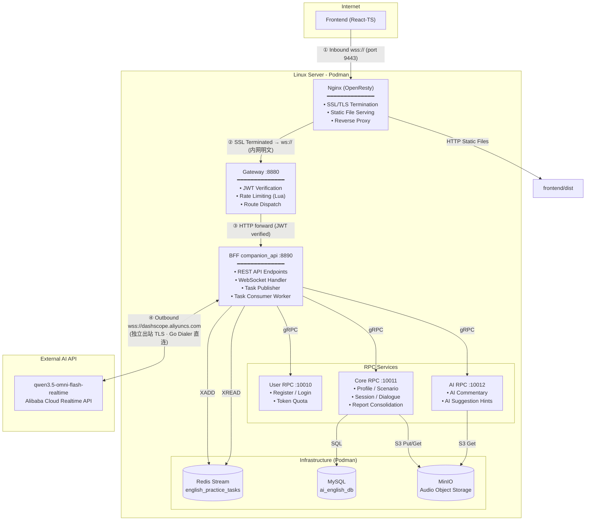

# AI English Speaking Companion (AI 英语口语陪练)

一款基于现代微服务架构与 Web Audio 实时通信技术的 AI 英语口语对讲练习与量化评测系统。系统支持多维练习场景选择（包括预设场景如外企面试、西餐点餐、雅思口语模拟、商务会议等，以及用户自定义场景）、高灵敏的实时语音对讲、智能破题思路锦囊和课后的语法/发音多维度分析成绩单。

---

## 🏗️ 系统架构设计

系统由 **Frontend (React-TS)** 交互层、**Nginx (OpenResty)** 反向代理与入站 SSL 卸载层、**Gateway** JWT 鉴权与路由层、**BFF companion_api** REST/WebSocket 聚合层、**RPC 微服务** 领域层以及 **Redis Stream 异步任务队列** 组成。

> **📌 双段独立 TLS 说明**：本系统存在两段方向相反、互不干扰的 TLS 连接：
> - **入站 TLS 终止（Inbound Termination）**：浏览器以 `wss://` 访问 Nginx，Nginx 持有域名证书，在边缘**卸载 SSL**，将流量以明文 `ws://` 在内网转发给 Gateway → BFF，降低后端负担。
> - **出站 TLS 发起（Outbound Origination）**：BFF 作为客户端，用 Go 的 `websocket.DefaultDialer` 主动向阿里云公网 `wss://dashscope.aliyuncs.com` **发起加密连接**，保护音频流在公网传输中的安全。
>
> 两段 TLS 的证书、方向、发起方均不同，不存在"卸载后重装"的矛盾。



---

## 🌟 核心功能特性

1. **个性化学习背景档案 (Step 1)**
   - 支持对用户当前的英语口语水平级别（初级 🌱、中级 🚀、高级 🏆）进行一键设定。
   - 允许用户定义详细的口语练习目标与练习侧重点。
2. **多场景智能切换练习 (Step 2)**
   - **外企求职面试 (Job Interview)**：模拟外企 HR 及技术面试官的专业英语提问。
   - **西餐点餐体验 (Ordering Food)**：练习日常用餐中的表达、菜品询问与结账会话。
   - **雅思口语模拟 (IELTS Speaking)**：覆盖雅思 Part 1-3 流程的模拟真题对答。
   - **商务会议沟通 (Business Meeting)**：练习职场讨论中的报告呈递、意见阐述与讨论。
   - **自定义练习场景**：用户可输入专有场景名称与 AI 引导 Prompts 进行专属互动。
3. **低延迟端到端语音对讲 (Step 3)**
   - 前端利用 Web Audio API 捕获 16kHz 的单声道 PCM 语音，通过双向 WebSocket 协议分片流式上传至后台 Gateway。
   - 后台自适应桥接多模态大语言模型（如 Gemini Live / Qwen-Omni 实时语音流），实现毫秒级语音回复。
4. **实时智能破题锦囊 (AI Hint)**
   - 大模型在完成发问后，后台根据上下文提示词系统在极短时间内生成 1-4 个英文关键思路或句式模版。
   - 前端以悬浮的半透明毛玻璃气泡（Tag Pills）流式呈现在右下角，解决口语表达“卡壳”问题。
5. **多维能力量化报告 (Report Page)**
   - 对话结束后自动转录完整对话记录（AI 老师与您的对答）。
   - 从发音与流利度（Fluency & Flow）、用词与表达（Vocabulary & Word Choice）、语法结构（Grammar & Accuracy）及地道改写（Refined Rewrite）等五个维度生成百分制柱状量化分析图，并给出教师寄语。

---

## 📂 项目目录结构

```text
ai_english_companion/
├── backend/                  # 后端 Go-zero 微服务
│   ├── gateway/              # 网关层，处理统一 JWT 鉴权与服务路由分发
│   ├── companion_api/        # BFF 网关服务，提供 REST API 和实时 WebSocket 接口
│   ├── pkg/                  # 公用工具包 (包含鉴权、错误响应、存储适配器)
│   ├── rpc/                  # RPC 领域微服务层
│   │   ├── ai/               # AI 评测与锦囊 RPC 服务
│   │   ├── core/             # 核心业务 (用户档案/场景/会话) 数据库读写 RPC 服务
│   │   └── user/             # 用户管理及 Token 额度控制 RPC 服务
│   ├── init.sql              # MySQL 数据库初始化 SQL 脚本
│   └── go.mod                # Go 后端依赖配置
├── frontend/                 # 前端 React-TypeScript SPA
│   ├── public/               # 公用静态资源
│   ├── src/
│   │   ├── components/       # 成绩柱状图、毛玻璃卡片、音频波形图等通用组件
│   │   ├── pages/            # 仪表盘配置页、对讲房间页、评估报告页
│   │   ├── services/         # 前端 API 请求与数据网桥服务
│   │   └── styles/           # 统一色调系统 (CSS Variables) 与全平台毛玻璃特效
│   └── package.json          # Node 依赖配置与 Vite 编译脚本
└── README.md                 # 项目说明文档
```

---

## 🚀 本地运行指南

### 1. 数据库配置
导入后端目录下的 `init.sql` 到您的 MySQL 实例中，它会自动创建 `ai_english_db` 数据库及包含 `user_profiles`（用户背景表）、`scenarios`（场景配置表）、`practice_sessions`（会话表）和 `dialogues`（对话记录表）在内的所有必要表结构。

### 2. 环境变量设定
在 `backend/.env` 中配置文件中设定您的数据库连接及大模型 API Key（Gemini / Aliyun DashScope）。

### 3. 运行 Go 后端服务
可直接使用 Go 编译各目录：
```bash
# 启动 core rpc 服务
cd backend/rpc/core
go run core.go

# 启动 ai rpc 服务
cd backend/rpc/ai
go run ai.go

# 启动 user rpc 服务
cd backend/rpc/user
go run user.go

# 启动 BFF API 接口服务
cd backend/companion_api
go run companion.go

# 启动 Gateway 网关服务
cd backend/gateway
go run main.go
```
*(注：Linux 服务器上可将二进制文件交叉编译后上传，并运行根目录下的 `start_services.sh` 一键启动全部后端服务)*

### 4. 运行前端应用
```bash
cd frontend
npm install
npm run dev
```
启动后在浏览器打开控制台输出的本地服务地址（如 `http://localhost:5173`）即可进入口语练习仪表盘。

---

## 🎨 视觉与 UI 设计系统

本系统采用了符合现代网页设计规范的 **Glassmorphism (毛玻璃透明特效) 视觉体系**：
- **Tailored HSL 色彩系统**：精心调配的莫兰迪蓝 `#0066CC`（深邃且专业）和极光紫 `#5C2D91`（点缀科技感），提供舒适高雅的视觉感受。
- **动态微交互动画**：主页场景卡片及提示气泡在 hover 时具有微幅上浮、软阴影扩散与高亮发光效果，交互细腻自然。
- **现代化字体**：引入 Google Fonts 中的 `Outfit` 作为大标题显示，搭配 `Inter` 渲染细节文本，提供 premium 级别的排版观感。
